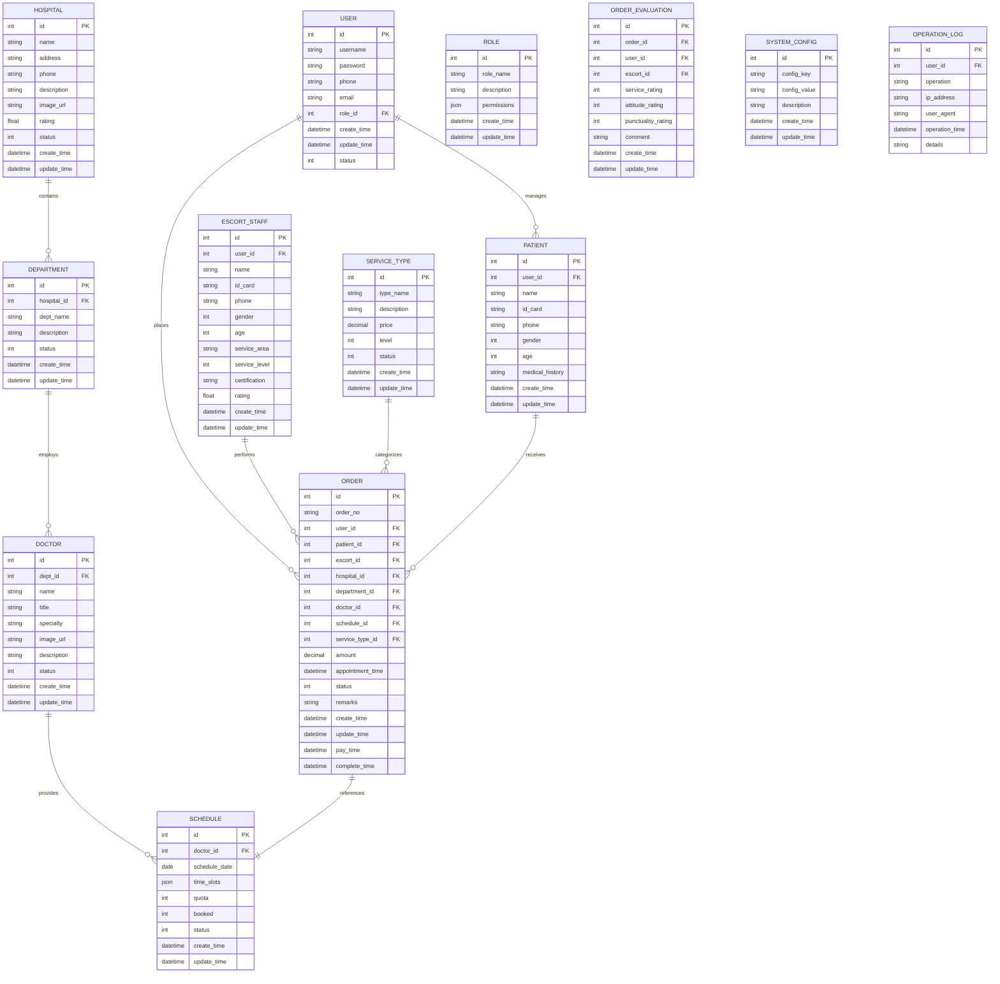

# 数据库设计

## 概述

本系统使用关系型数据库设计，主要包含用户管理、订单管理、医院管理、服务管理等核心模块的数据表设计。数据库采用合理的表结构和字段设计，确保系统高效运行和数据完整性。

## ER 图

## 数据表设计

### 1. 用户相关表

#### 1.1 用户表(sys_user)

| 字段名          | 数据类型 | 长度 | 允许空 | 主键 | 默认值            | 说明                   |
| --------------- | -------- | ---- | ------ | ---- | ----------------- | ---------------------- |
| id              | int      | 11   | 否     | 是   | 自增              | 用户 ID                |
| username        | varchar  | 50   | 否     |      |                   | 用户名                 |
| password        | varchar  | 255  | 否     |      |                   | 密码                   |
| salt            | varchar  | 50   | 否     |      |                   | 加密盐                 |
| phone           | varchar  | 20   | 是     |      |                   | 手机号码               |
| email           | varchar  | 100  | 是     |      |                   | 电子邮件               |
| avatar          | varchar  | 255  | 是     |      |                   | 头像 URL               |
| real_name       | varchar  | 50   | 是     |      |                   | 真实姓名               |
| gender          | tinyint  | 1    | 是     |      | 0                 | 性别(0:未知,1:男,2:女) |
| role_id         | int      | 11   | 否     |      |                   | 角色 ID                |
| dept_id         | int      | 11   | 是     |      |                   | 部门 ID(仅管理员)      |
| status          | tinyint  | 1    | 否     |      | 1                 | 状态(0:禁用,1:启用)    |
| open_id         | varchar  | 50   | 是     |      |                   | 小程序 OpenID          |
| last_login_time | datetime |      | 是     |      |                   | 最后登录时间           |
| create_time     | datetime |      | 否     |      | CURRENT_TIMESTAMP | 创建时间               |
| update_time     | datetime |      | 否     |      | CURRENT_TIMESTAMP | 更新时间               |
| create_by       | int      | 11   | 是     |      |                   | 创建人 ID              |
| update_by       | int      | 11   | 是     |      |                   | 更新人 ID              |

#### 1.2 角色表(sys_role)

| 字段名      | 数据类型 | 长度 | 允许空 | 主键 | 默认值            | 说明                |
| ----------- | -------- | ---- | ------ | ---- | ----------------- | ------------------- |
| id          | int      | 11   | 否     | 是   | 自增              | 角色 ID             |
| role_name   | varchar  | 50   | 否     |      |                   | 角色名称            |
| role_key    | varchar  | 50   | 否     |      |                   | 角色标识            |
| description | varchar  | 255  | 是     |      |                   | 角色描述            |
| permissions | json     |      | 是     |      |                   | 权限配置            |
| status      | tinyint  | 1    | 否     |      | 1                 | 状态(0:禁用,1:启用) |
| sort        | int      | 11   | 是     |      | 0                 | 排序号              |
| create_time | datetime |      | 否     |      | CURRENT_TIMESTAMP | 创建时间            |
| update_time | datetime |      | 否     |      | CURRENT_TIMESTAMP | 更新时间            |
| create_by   | int      | 11   | 是     |      |                   | 创建人 ID           |
| update_by   | int      | 11   | 是     |      |                   | 更新人 ID           |

#### 1.3 权限菜单表(sys_permission)

| 字段名      | 数据类型 | 长度 | 允许空 | 主键 | 默认值            | 说明                       |
| ----------- | -------- | ---- | ------ | ---- | ----------------- | -------------------------- |
| id          | int      | 11   | 否     | 是   | 自增              | 权限 ID                    |
| parent_id   | int      | 11   | 是     |      | 0                 | 父权限 ID                  |
| name        | varchar  | 50   | 否     |      |                   | 权限名称                   |
| type        | tinyint  | 1    | 否     |      |                   | 类型(0:目录,1:菜单,2:按钮) |
| path        | varchar  | 255  | 是     |      |                   | 路由路径                   |
| component   | varchar  | 255  | 是     |      |                   | 组件路径                   |
| perms       | varchar  | 100  | 是     |      |                   | 权限标识                   |
| icon        | varchar  | 100  | 是     |      |                   | 图标                       |
| sort        | int      | 11   | 是     |      | 0                 | 排序号                     |
| hidden      | tinyint  | 1    | 是     |      | 0                 | 是否隐藏(0:显示,1:隐藏)    |
| status      | tinyint  | 1    | 否     |      | 1                 | 状态(0:禁用,1:启用)        |
| create_time | datetime |      | 否     |      | CURRENT_TIMESTAMP | 创建时间                   |
| update_time | datetime |      | 否     |      | CURRENT_TIMESTAMP | 更新时间                   |

### 2. 就诊人相关表

#### 2.1 就诊人表(patient_info)

| 字段名          | 数据类型 | 长度 | 允许空 | 主键 | 默认值            | 说明                |
| --------------- | -------- | ---- | ------ | ---- | ----------------- | ------------------- |
| id              | int      | 11   | 否     | 是   | 自增              | 就诊人 ID           |
| user_id         | int      | 11   | 否     |      |                   | 所属用户 ID         |
| name            | varchar  | 50   | 否     |      |                   | 姓名                |
| id_card         | varchar  | 18   | 否     |      |                   | 身份证号            |
| phone           | varchar  | 20   | 是     |      |                   | 联系电话            |
| gender          | tinyint  | 1    | 否     |      |                   | 性别(1:男,2:女)     |
| birthday        | date     |      | 是     |      |                   | 出生日期            |
| age             | int      | 3    | 是     |      |                   | 年龄                |
| address         | varchar  | 255  | 是     |      |                   | 住址                |
| medical_history | text     |      | 是     |      |                   | 病史记录            |
| relation        | varchar  | 20   | 是     |      |                   | 与用户关系          |
| is_default      | tinyint  | 1    | 否     |      | 0                 | 是否默认(0:否,1:是) |
| create_time     | datetime |      | 否     |      | CURRENT_TIMESTAMP | 创建时间            |
| update_time     | datetime |      | 否     |      | CURRENT_TIMESTAMP | 更新时间            |

#### 2.2 陪诊人员表(escort_staff)

| 字段名           | 数据类型 | 长度 | 允许空 | 主键 | 默认值            | 说明                    |
| ---------------- | -------- | ---- | ------ | ---- | ----------------- | ----------------------- |
| id               | int      | 11   | 否     | 是   | 自增              | 陪诊人员 ID             |
| user_id          | int      | 11   | 否     |      |                   | 所属用户 ID             |
| name             | varchar  | 50   | 否     |      |                   | 姓名                    |
| id_card          | varchar  | 18   | 否     |      |                   | 身份证号                |
| phone            | varchar  | 20   | 否     |      |                   | 联系电话                |
| gender           | tinyint  | 1    | 否     |      |                   | 性别(1:男,2:女)         |
| age              | int      | 3    | 是     |      |                   | 年龄                    |
| service_area     | varchar  | 500  | 是     |      |                   | 服务区域(JSON 格式)     |
| service_level    | tinyint  | 1    | 否     |      | 1                 | 服务级别(1:普通,2:专业) |
| certification    | varchar  | 255  | 是     |      |                   | 资质认证                |
| photo            | varchar  | 255  | 是     |      |                   | 照片 URL                |
| introduction     | text     |      | 是     |      |                   | 个人简介                |
| rating           | decimal  | 3,1  | 是     |      | 5.0               | 评分                    |
| completed_orders | int      | 11   | 是     |      | 0                 | 已完成订单数            |
| status           | tinyint  | 1    | 否     |      | 1                 | 状态(0:禁用,1:启用)     |
| create_time      | datetime |      | 否     |      | CURRENT_TIMESTAMP | 创建时间                |
| update_time      | datetime |      | 否     |      | CURRENT_TIMESTAMP | 更新时间                |

### 3. 医院相关表

#### 3.1 医院表(hospital)

| 字段名      | 数据类型 | 长度 | 允许空 | 主键 | 默认值            | 说明                |
| ----------- | -------- | ---- | ------ | ---- | ----------------- | ------------------- |
| id          | int      | 11   | 否     | 是   | 自增              | 医院 ID             |
| name        | varchar  | 100  | 否     |      |                   | 医院名称            |
| province    | varchar  | 50   | 否     |      |                   | 省份                |
| city        | varchar  | 50   | 否     |      |                   | 城市                |
| district    | varchar  | 50   | 是     |      |                   | 区/县               |
| address     | varchar  | 255  | 否     |      |                   | 详细地址            |
| phone       | varchar  | 20   | 是     |      |                   | 联系电话            |
| level       | varchar  | 50   | 是     |      |                   | 医院等级            |
| category    | varchar  | 50   | 是     |      |                   | 医院类别            |
| description | text     |      | 是     |      |                   | 医院描述            |
| image_url   | varchar  | 255  | 是     |      |                   | 医院图片 URL        |
| longitude   | decimal  | 10,7 | 是     |      |                   | 经度                |
| latitude    | decimal  | 10,7 | 是     |      |                   | 纬度                |
| rating      | decimal  | 3,1  | 是     |      | 5.0               | 评分                |
| status      | tinyint  | 1    | 否     |      | 1                 | 状态(0:禁用,1:启用) |
| create_time | datetime |      | 否     |      | CURRENT_TIMESTAMP | 创建时间            |
| update_time | datetime |      | 否     |      | CURRENT_TIMESTAMP | 更新时间            |
| create_by   | int      | 11   | 是     |      |                   | 创建人 ID           |
| update_by   | int      | 11   | 是     |      |                   | 更新人 ID           |

#### 3.2 科室表(department)

| 字段名      | 数据类型 | 长度 | 允许空 | 主键 | 默认值            | 说明                |
| ----------- | -------- | ---- | ------ | ---- | ----------------- | ------------------- |
| id          | int      | 11   | 否     | 是   | 自增              | 科室 ID             |
| hospital_id | int      | 11   | 否     |      |                   | 所属医院 ID         |
| dept_name   | varchar  | 50   | 否     |      |                   | 科室名称            |
| dept_code   | varchar  | 50   | 是     |      |                   | 科室代码            |
| parent_id   | int      | 11   | 是     |      | 0                 | 父科室 ID           |
| description | text     |      | 是     |      |                   | 科室描述            |
| image_url   | varchar  | 255  | 是     |      |                   | 科室图片 URL        |
| status      | tinyint  | 1    | 否     |      | 1                 | 状态(0:禁用,1:启用) |
| sort        | int      | 11   | 是     |      | 0                 | 排序号              |
| create_time | datetime |      | 否     |      | CURRENT_TIMESTAMP | 创建时间            |
| update_time | datetime |      | 否     |      | CURRENT_TIMESTAMP | 更新时间            |
| create_by   | int      | 11   | 是     |      |                   | 创建人 ID           |
| update_by   | int      | 11   | 是     |      |                   | 更新人 ID           |

#### 3.3 医生表(doctor)

| 字段名           | 数据类型 | 长度 | 允许空 | 主键 | 默认值            | 说明                |
| ---------------- | -------- | ---- | ------ | ---- | ----------------- | ------------------- |
| id               | int      | 11   | 否     | 是   | 自增              | 医生 ID             |
| dept_id          | int      | 11   | 否     |      |                   | 所属科室 ID         |
| hospital_id      | int      | 11   | 否     |      |                   | 所属医院 ID         |
| name             | varchar  | 50   | 否     |      |                   | 医生姓名            |
| title            | varchar  | 50   | 是     |      |                   | 职称                |
| specialty        | varchar  | 255  | 是     |      |                   | 专长                |
| image_url        | varchar  | 255  | 是     |      |                   | 医生照片 URL        |
| description      | text     |      | 是     |      |                   | 医生简介            |
| consultation_fee | decimal  | 10,2 | 是     |      |                   | 挂号费用            |
| rating           | decimal  | 3,1  | 是     |      | 5.0               | 医生评分            |
| status           | tinyint  | 1    | 否     |      | 1                 | 状态(0:禁用,1:启用) |
| sort             | int      | 11   | 是     |      | 0                 | 排序号              |
| create_time      | datetime |      | 否     |      | CURRENT_TIMESTAMP | 创建时间            |
| update_time      | datetime |      | 否     |      | CURRENT_TIMESTAMP | 更新时间            |
| create_by        | int      | 11   | 是     |      |                   | 创建人 ID           |
| update_by        | int      | 11   | 是     |      |                   | 更新人 ID           |

#### 3.4 排班表(doctor_schedule)

| 字段名        | 数据类型 | 长度 | 允许空 | 主键 | 默认值            | 说明                       |
| ------------- | -------- | ---- | ------ | ---- | ----------------- | -------------------------- |
| id            | int      | 11   | 否     | 是   | 自增              | 排班 ID                    |
| doctor_id     | int      | 11   | 否     |      |                   | 医生 ID                    |
| dept_id       | int      | 11   | 否     |      |                   | 科室 ID                    |
| hospital_id   | int      | 11   | 否     |      |                   | 医院 ID                    |
| schedule_date | date     |      | 否     |      |                   | 排班日期                   |
| time_slots    | json     |      | 否     |      |                   | 时间段配置                 |
| period        | tinyint  | 1    | 否     |      |                   | 时段(1:上午,2:下午,3:晚上) |
| quota         | int      | 11   | 否     |      | 0                 | 总号源数量                 |
| booked        | int      | 11   | 是     |      | 0                 | 已预约数量                 |
| status        | tinyint  | 1    | 否     |      | 1                 | 状态(0:停诊,1:正常)        |
| create_time   | datetime |      | 否     |      | CURRENT_TIMESTAMP | 创建时间                   |
| update_time   | datetime |      | 否     |      | CURRENT_TIMESTAMP | 更新时间                   |
| create_by     | int      | 11   | 是     |      |                   | 创建人 ID                  |
| update_by     | int      | 11   | 是     |      |                   | 更新人 ID                  |

### 4. 服务相关表

#### 4.1 服务类型表(service_type)

| 字段名       | 数据类型 | 长度 | 允许空 | 主键 | 默认值            | 说明                                   |
| ------------ | -------- | ---- | ------ | ---- | ----------------- | -------------------------------------- |
| id           | int      | 11   | 否     | 是   | 自增              | 服务类型 ID                            |
| type_name    | varchar  | 100  | 否     |      |                   | 服务类型名称                           |
| service_code | varchar  | 50   | 是     |      |                   | 服务代码                               |
| category     | tinyint  | 1    | 否     |      |                   | 类别(1:预约挂号,2:辅助就诊,3:全程陪诊) |
| description  | text     |      | 是     |      |                   | 服务描述                               |
| price        | decimal  | 10,2 | 否     |      | 0.00              | 服务价格                               |
| level        | tinyint  | 1    | 否     |      | 1                 | 服务级别(1:普通,2:高级,3:VIP)          |
| icon         | varchar  | 255  | 是     |      |                   | 服务图标 URL                           |
| status       | tinyint  | 1    | 否     |      | 1                 | 状态(0:禁用,1:启用)                    |
| sort         | int      | 11   | 是     |      | 0                 | 排序号                                 |
| create_time  | datetime |      | 否     |      | CURRENT_TIMESTAMP | 创建时间                               |
| update_time  | datetime |      | 否     |      | CURRENT_TIMESTAMP | 更新时间                               |
| create_by    | int      | 11   | 是     |      |                   | 创建人 ID                              |
| update_by    | int      | 11   | 是     |      |                   | 更新人 ID                              |

### 5. 订单相关表

#### 5.1 订单表(order)

| 字段名           | 数据类型 | 长度 | 允许空 | 主键 | 默认值            | 说明                                                            |
| ---------------- | -------- | ---- | ------ | ---- | ----------------- | --------------------------------------------------------------- |
| id               | int      | 11   | 否     | 是   | 自增              | 订单 ID                                                         |
| order_no         | varchar  | 32   | 否     |      |                   | 订单编号                                                        |
| user_id          | int      | 11   | 否     |      |                   | 用户 ID                                                         |
| patient_id       | int      | 11   | 否     |      |                   | 就诊人 ID                                                       |
| escort_id        | int      | 11   | 是     |      |                   | 陪诊人员 ID                                                     |
| hospital_id      | int      | 11   | 是     |      |                   | 医院 ID                                                         |
| department_id    | int      | 11   | 是     |      |                   | 科室 ID                                                         |
| doctor_id        | int      | 11   | 是     |      |                   | 医生 ID                                                         |
| schedule_id      | int      | 11   | 是     |      |                   | 排班 ID                                                         |
| service_type_id  | int      | 11   | 否     |      |                   | 服务类型 ID                                                     |
| amount           | decimal  | 10,2 | 否     |      | 0.00              | 订单金额                                                        |
| appointment_time | datetime |      | 是     |      |                   | 预约时间                                                        |
| status           | tinyint  | 1    | 否     |      | 0                 | 订单状态(0:待支付,1:已支付,2:进行中,3:已完成,4:已取消,5:已退款) |
| remarks          | varchar  | 500  | 是     |      |                   | 备注说明                                                        |
| create_time      | datetime |      | 否     |      | CURRENT_TIMESTAMP | 创建时间                                                        |
| update_time      | datetime |      | 否     |      | CURRENT_TIMESTAMP | 更新时间                                                        |
| pay_time         | datetime |      | 是     |      |                   | 支付时间                                                        |
| complete_time    | datetime |      | 是     |      |                   | 完成时间                                                        |
| cancel_time      | datetime |      | 是     |      |                   | 取消时间                                                        |
| cancel_reason    | varchar  | 255  | 是     |      |                   | 取消原因                                                        |

#### 5.2 订单评价表(order_evaluation)

| 字段名             | 数据类型 | 长度 | 允许空 | 主键 | 默认值            | 说明                |
| ------------------ | -------- | ---- | ------ | ---- | ----------------- | ------------------- |
| id                 | int      | 11   | 否     | 是   | 自增              | 评价 ID             |
| order_id           | int      | 11   | 否     |      |                   | 订单 ID             |
| user_id            | int      | 11   | 否     |      |                   | 用户 ID             |
| escort_id          | int      | 11   | 是     |      |                   | 陪诊人员 ID         |
| service_rating     | tinyint  | 1    | 是     |      | 5                 | 服务评分(1-5)       |
| attitude_rating    | tinyint  | 1    | 是     |      | 5                 | 态度评分(1-5)       |
| punctuality_rating | tinyint  | 1    | 是     |      | 5                 | 守时评分(1-5)       |
| overall_rating     | tinyint  | 1    | 是     |      | 5                 | 总体评分(1-5)       |
| comment            | text     |      | 是     |      |                   | 评价内容            |
| reply              | text     |      | 是     |      |                   | 商家回复            |
| images             | varchar  | 500  | 是     |      |                   | 评价图片(JSON 格式) |
| is_anonymous       | tinyint  | 1    | 是     |      | 0                 | 是否匿名(0:否,1:是) |
| create_time        | datetime |      | 否     |      | CURRENT_TIMESTAMP | 创建时间            |
| update_time        | datetime |      | 否     |      | CURRENT_TIMESTAMP | 更新时间            |

#### 5.3 支付记录表(payment_record)

| 字段名           | 数据类型 | 长度 | 允许空 | 主键 | 默认值            | 说明                                 |
| ---------------- | -------- | ---- | ------ | ---- | ----------------- | ------------------------------------ |
| id               | int      | 11   | 否     | 是   | 自增              | 支付记录 ID                          |
| order_id         | int      | 11   | 否     |      |                   | 订单 ID                              |
| order_no         | varchar  | 32   | 否     |      |                   | 订单编号                             |
| user_id          | int      | 11   | 否     |      |                   | 用户 ID                              |
| payment_no       | varchar  | 64   | 是     |      |                   | 支付流水号                           |
| amount           | decimal  | 10,2 | 否     |      | 0.00              | 支付金额                             |
| payment_method   | tinyint  | 1    | 否     |      |                   | 支付方式(1:微信,2:支付宝)            |
| payment_status   | tinyint  | 1    | 否     |      | 0                 | 支付状态(0:未支付,1:已支付,2:已退款) |
| create_time      | datetime |      | 否     |      | CURRENT_TIMESTAMP | 创建时间                             |
| update_time      | datetime |      | 否     |      | CURRENT_TIMESTAMP | 更新时间                             |
| pay_time         | datetime |      | 是     |      |                   | 支付时间                             |
| refund_time      | datetime |      | 是     |      |                   | 退款时间                             |
| transaction_data | json     |      | 是     |      |                   | 交易详情数据                         |

### 6. 系统设置表

#### 6.1 系统配置表(system_config)

| 字段名       | 数据类型 | 长度 | 允许空 | 主键 | 默认值            | 说明                    |
| ------------ | -------- | ---- | ------ | ---- | ----------------- | ----------------------- |
| id           | int      | 11   | 否     | 是   | 自增              | 配置 ID                 |
| config_key   | varchar  | 100  | 否     |      |                   | 配置键                  |
| config_value | text     |      | 否     |      |                   | 配置值                  |
| config_type  | tinyint  | 1    | 是     |      | 0                 | 配置类型(0:系统,1:业务) |
| description  | varchar  | 255  | 是     |      |                   | 配置描述                |
| create_time  | datetime |      | 否     |      | CURRENT_TIMESTAMP | 创建时间                |
| update_time  | datetime |      | 否     |      | CURRENT_TIMESTAMP | 更新时间                |
| create_by    | int      | 11   | 是     |      |                   | 创建人 ID               |
| update_by    | int      | 11   | 是     |      |                   | 更新人 ID               |

#### 6.2 操作日志表(operation_log)

| 字段名         | 数据类型 | 长度 | 允许空 | 主键 | 默认值            | 说明                    |
| -------------- | -------- | ---- | ------ | ---- | ----------------- | ----------------------- |
| id             | int      | 11   | 否     | 是   | 自增              | 日志 ID                 |
| user_id        | int      | 11   | 是     |      |                   | 用户 ID                 |
| username       | varchar  | 50   | 是     |      |                   | 用户名                  |
| operation      | varchar  | 255  | 否     |      |                   | 操作内容                |
| method         | varchar  | 255  | 是     |      |                   | 请求方法                |
| params         | text     |      | 是     |      |                   | 请求参数                |
| ip_address     | varchar  | 50   | 是     |      |                   | IP 地址                 |
| user_agent     | varchar  | 255  | 是     |      |                   | 用户代理                |
| request_uri    | varchar  | 255  | 是     |      |                   | 请求 URI                |
| execution_time | int      | 11   | 是     |      |                   | 执行时长(毫秒)          |
| operation_time | datetime |      | 否     |      | CURRENT_TIMESTAMP | 操作时间                |
| status         | tinyint  | 1    | 是     |      | 0                 | 操作状态(0:失败,1:成功) |
| details        | text     |      | 是     |      |                   | 详细信息                |

## 表关系说明

1. **用户关系**:

   - 一个用户可以管理多个就诊人信息(1:N)
   - 一个用户可以下多个订单(1:N)
   - 用户角色通过 role_id 关联到角色表(N:1)

2. **医院关系**:

   - 一个医院包含多个科室(1:N)
   - 一个科室拥有多个医生(1:N)
   - 一个医生提供多个排班(1:N)

3. **订单关系**:

   - 一个订单关联一个用户(N:1)
   - 一个订单关联一个就诊人(N:1)
   - 一个订单关联一个陪诊人员(N:1)
   - 一个订单关联一个服务类型(N:1)
   - 一个订单可能关联一个排班(N:1)
   - 一个订单有一个评价(1:1)
   - 一个订单有一个支付记录(1:1)

4. **陪诊人员关系**:
   - 陪诊人员关联到用户表(N:1)
   - 陪诊人员可以执行多个订单(1:N)

## 索引设计

为了提高查询性能，对常用查询字段建立索引:

1. **用户表(sys_user)**:

   - phone (普通索引)
   - email (普通索引)
   - open_id (普通索引)
   - role_id (普通索引)
   - status (普通索引)

2. **就诊人表(patient_info)**:

   - user_id (普通索引)
   - id_card (普通索引)

3. **陪诊人员表(escort_staff)**:

   - user_id (普通索引)
   - service_level, rating (组合索引)
   - status (普通索引)

4. **医院表(hospital)**:

   - city, district (组合索引)
   - status (普通索引)

5. **科室表(department)**:

   - hospital_id (普通索引)
   - parent_id (普通索引)

6. **医生表(doctor)**:

   - hospital_id (普通索引)
   - dept_id (普通索引)
   - title (普通索引)

7. **排班表(doctor_schedule)**:

   - doctor_id, schedule_date (组合索引)
   - hospital_id, dept_id, schedule_date (组合索引)
   - status (普通索引)

8. **订单表(order)**:

   - order_no (唯一索引)
   - user_id (普通索引)
   - escort_id (普通索引)
   - patient_id (普通索引)
   - status (普通索引)
   - create_time (普通索引)

9. **支付记录表(payment_record)**:
   - order_id (普通索引)
   - payment_no (普通索引)
   - payment_status (普通索引)
