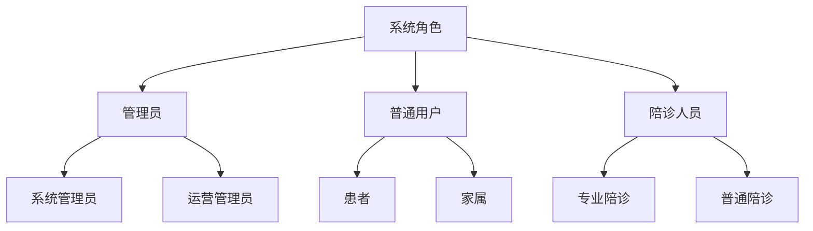
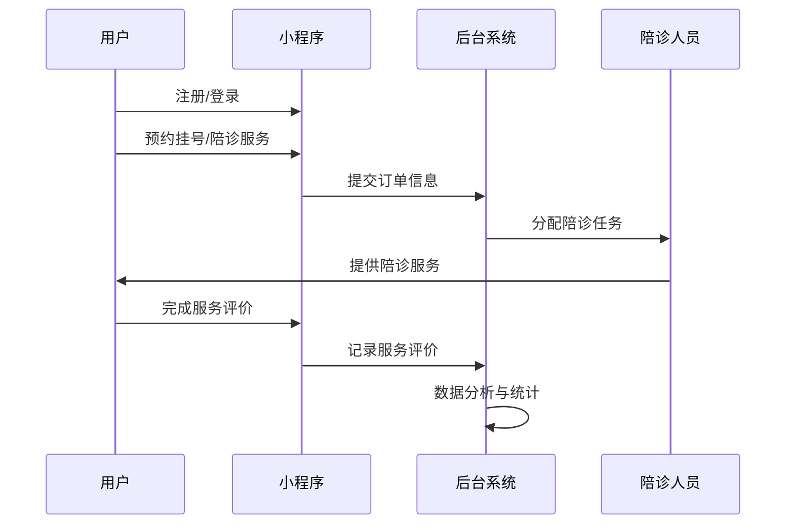
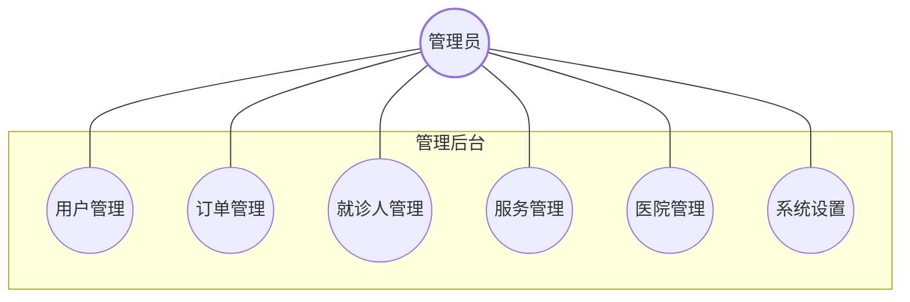
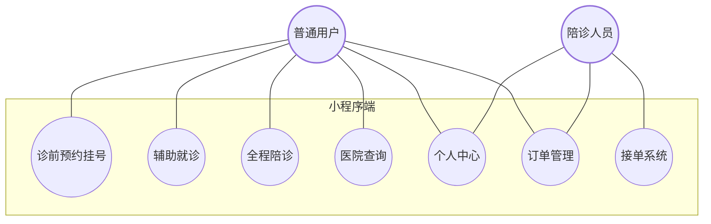

# 需求分析

本系统是一个医疗陪诊服务管理平台，主要分为管理后台和小程序前端两部分。系统旨在为患者提供挂号预约、医疗陪诊等一站式医疗服务解决方案。

## 系统角色

```mermaid
graph TD
    A[系统角色] --> B[管理员]
    A --> C[普通用户]
    A --> D[陪诊人员]

    B --> B1[系统管理员]
    B --> B2[运营管理员]

    C --> C1[患者]
    C --> C2[家属]

    D --> D1[专业陪诊]
    D --> D2[普通陪诊]
```

## 核心业务流程

```mermaid
sequenceDiagram
    participant 用户
    participant 小程序
    participant 后台系统
    participant 陪诊人员

    用户->>小程序: 注册/登录
    用户->>小程序: 预约挂号/陪诊服务
    小程序->>后台系统: 提交订单信息
    后台系统->>陪诊人员: 分配陪诊任务
    陪诊人员->>用户: 提供陪诊服务
    用户->>小程序: 完成服务评价
    小程序->>后台系统: 记录服务评价
    后台系统->>后台系统: 数据分析与统计
```

## 用例分析

### 管理后台

```mermaid
graph TD
    %% 角色定义
    admin((管理员))

    %% 后台用例
    um((用户管理))
    om((订单管理))
    pm((就诊人管理))
    sm((服务管理))
    hm((医院管理))
    ss((系统设置))

    %% 关系连接
    admin --- um
    admin --- om
    admin --- pm
    admin --- sm
    admin --- hm
    admin --- ss

    %% 用例分组
    subgraph 管理后台
        um
        om
        pm
        sm
        hm
        ss
    end

    classDef actor fill:#lightblue,stroke:#blue,stroke-width:2px;
    classDef usecase fill:#lightgreen,stroke:#green,stroke-width:1px,rx:15px,ry:10px;

    class admin actor;
    class um,om,pm,sm,hm,ss usecase;
```

### 小程序端

```mermaid
graph TD
    %% 角色定义
    user((普通用户))
    escort((陪诊人员))

    %% 小程序用例
    ar((诊前预约挂号))
    ad((辅助就诊))
    ae((全程陪诊))
    hs((医院查询))
    pc((个人中心))
    or((订单管理))
    ts((接单系统))

    %% 关系连接
    user --- ar
    user --- ad
    user --- ae
    user --- hs
    user --- pc
    user --- or

    escort --- pc
    escort --- or
    escort --- ts

    %% 用例分组
    subgraph 小程序端
        ar
        ad
        ae
        hs
        pc
        or
        ts
    end

    classDef actor fill:#lightblue,stroke:#blue,stroke-width:2px;
    classDef usecase fill:#lightgreen,stroke:#green,stroke-width:1px,rx:15px,ry:10px;

    class user,escort actor;
    class ar,ad,ae,hs,pc,or,ts usecase;
```
