# 总体设计

## 功能架构图

### 管理后台

#### 总览

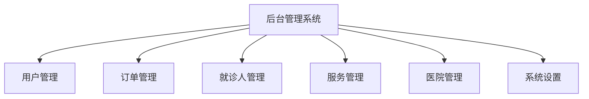

#### 用户管理模块

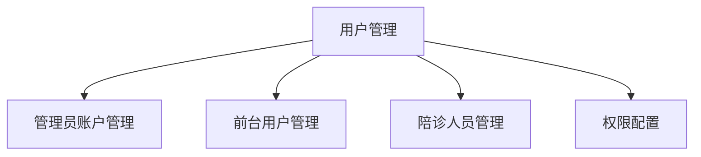

- **管理员账户管理**：创建、修改、删除后台管理员账户
- **前台用户管理**：查看、冻结/解冻用户账号
- **陪诊人员管理**：添加、修改、删除陪诊人员，设置服务范围
- **权限配置**：设置不同角色的系统权限

#### 订单管理模块

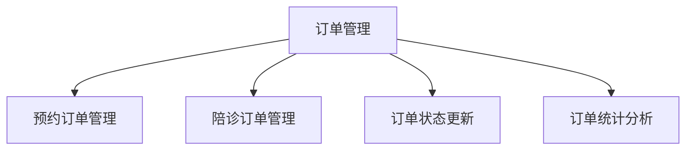

- **预约订单管理**：查看、修改、取消预约挂号订单
- **陪诊订单管理**：查看、分配、跟踪陪诊服务订单
- **订单状态更新**：实时更新订单状态（待支付、进行中、已完成等）
- **订单统计分析**：生成订单报表，分析业务数据

#### 就诊人管理模块

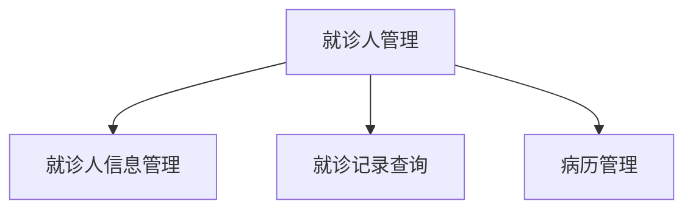

- **就诊人信息管理**：查看、修改就诊人基本信息
- **就诊记录查询**：查询就诊历史记录
- **病历管理**：上传、查看、分享患者病历资料

#### 服务管理模块

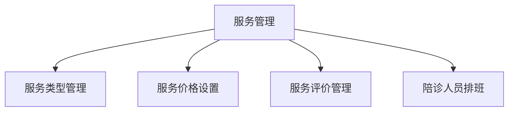

- **服务类型管理**：添加、修改、删除服务类型
- **服务价格设置**：设置不同级别服务的价格
- **服务评价管理**：查看用户评价，处理投诉
- **陪诊人员排班**：安排陪诊人员工作时间

#### 医院管理模块

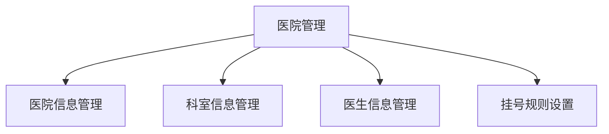

- **医院信息管理**：添加、修改、删除医院信息
- **科室信息管理**：管理医院科室信息
- **医生信息管理**：添加、更新医生信息
- **挂号规则设置**：设置各医院挂号规则和流程

#### 系统设置模块

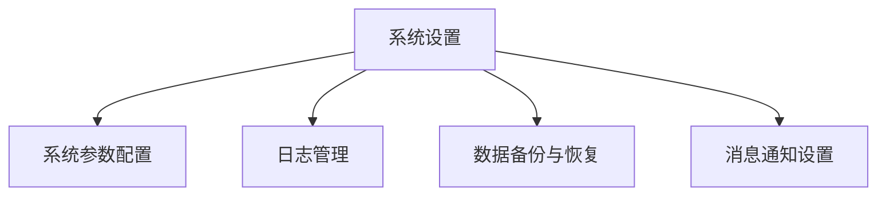

- **系统参数配置**：配置系统基本参数
- **日志管理**：查看系统操作日志
- **数据备份与恢复**：系统数据备份和恢复功能
- **消息通知设置**：配置系统通知规则

### 小程序端

#### 总览

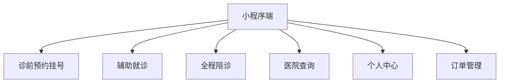

#### 诊前预约挂号模块

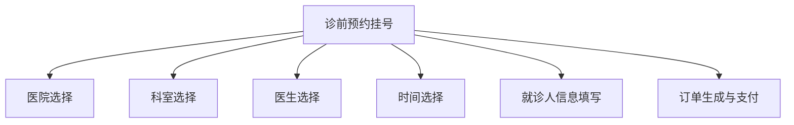

- **医院选择**：根据地区、专科特长等筛选合适医院
- **科室选择**：选择就诊科室
- **医生选择**：查看医生信息并选择合适的医生
- **时间选择**：选择可用的就诊时间段
- **就诊人信息填写**：填写或选择就诊人基本信息
- **订单生成与支付**：生成预约订单并完成支付

#### 辅助就诊模块

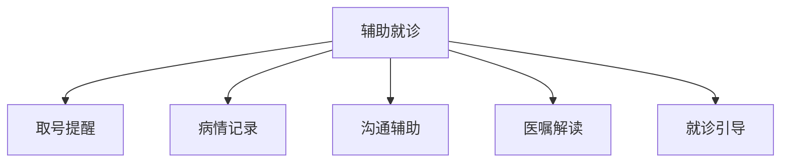

- **取号提醒**：到院后自动提醒取号流程
- **病情记录**：记录患者病情描述，方便与医生沟通
- **沟通辅助**：为沟通不便患者提供辅助工具
- **医嘱解读**：将医嘱转化为易懂的说明
- **就诊引导**：提供院内导航和就诊流程指引

#### 全程陪诊模块

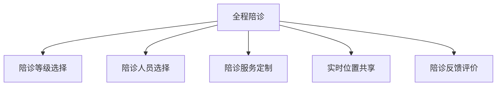

- **陪诊等级选择**：选择 VIP、高级、普通等不同服务等级
- **陪诊人员选择**：查看陪诊人员信息并选择
- **陪诊服务定制**：根据个人需求定制服务内容
- **实时位置共享**：实时查看陪诊人员位置
- **陪诊反馈评价**：对陪诊服务进行评价和反馈

#### 医院查询模块

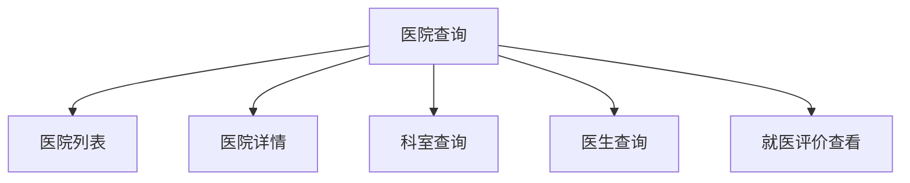

- **医院列表**：展示医院基本信息列表
- **医院详情**：查看医院详细信息和特色
- **科室查询**：查询医院科室设置情况
- **医生查询**：查询医生信息及出诊时间
- **就医评价查看**：查看其他患者对医院的评价

#### 个人中心模块

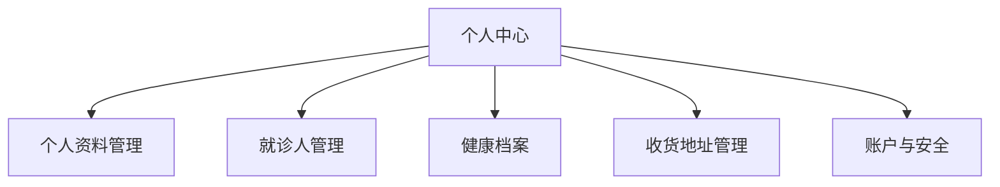

- **个人资料管理**：修改个人基本信息
- **就诊人管理**：添加、编辑、删除就诊人信息
- **健康档案**：管理个人健康记录和病历
- **收货地址管理**：管理收货地址信息
- **账户与安全**：修改密码、绑定手机等安全设置

#### 订单管理模块

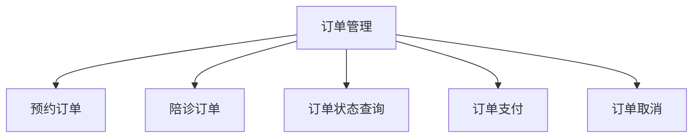

- **预约订单**：查看预约挂号订单记录
- **陪诊订单**：查看陪诊服务订单记录
- **订单状态查询**：查询订单当前状态
- **订单支付**：完成未支付订单的支付
- **订单取消**：取消未开始的订单
